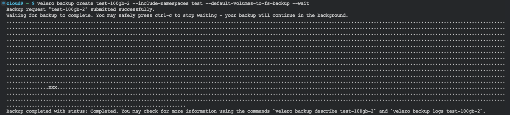

# Velero can use restic to save data.


Amazon S3
Restic can backup data to any Amazon S3 bucket. However, in this case, changing the URL scheme is not enough since Amazon uses special security credentials to sign HTTP requests. By consequence, you must first setup the following environment variables with the credentials you obtained while creating the bucket.


```bash
# Create the restic repository
restic -r s3:s3.amazonaws.com/management-eks-prod-eks-velero-backups init
pass: static-passw0rd
```
The **password** is used to encrypt the data on the bucket, and velero need it to restore the data and is store on velero secret velero-repo-credentials (base64 encoded)

```bash
# getting the password 
kubectl -n velero get secret velero-repo-credentials -o yaml
# decoding the password
```

### this add annotation to backup volume
kubectl -n test annotate pod/test-efs-app backup.velero.io/backup-volumes=test-efs-claim
velero backup create test-backup-13 --include-namespaces test --wait


### this create the backup to all pods
velero backup create test-backup-13 --include-namespaces test --default-volumes-to-fs-backup --wait

#### restoring backup to different namespace
velero restore create --from-backup test-backup-13 --namespace-mappings test:test1

for the init container fails, you can re-create the pod that is using the volume and it will work.

# TESTING VELERO EFS BACKUP

<!-- create an index o headers on this markdown file -->
<!-- Index -->
1. [Create a large file in the volume](#create-a-large-file-in-the-volume)
2. [Create the velero backup](#create-the-velero-backup)


## for testing
you can create a large file in the volume and then delete it, then create a backup and restore it to a different namespace and check if the file is there.


## Create a large file in the volume
```bash
# login on the pod
kubectl -n test exec -it test-efs-app -- bash
# create the file
dd if=/dev/zero of=data/largefile.img bs=1G count=109
```

## Create the velero backup
Here we are only backing up the namespace test, and the volume claim and volume. The default is to backup all the pods and volumes.
```bash
velero backup create test-backup-13 --include-namespaces test --default-volumes-to-fs-backup --include-resources  persistentvolumeclaims,persistentvolumes --wait
```


####Velero backup details

```bash
cloud9 ~ $ velero backup describe test-100gb-2 --details
Phase:  Completed
Backup Format Version:  1.1.0

Started:    2023-10-11 15:58:04 +0000 UTC
Completed:  2023-10-11 16:40:40 +0000 UTC
```

## Remving files
Log on the pod and delete the large file
```bash
kubectl -n test exec -it test-efs-app -- bash
rm -rf data/largefile.img
```

## Restoring
To restore the EFS volume, you must delete the existing PVC and PV. If velero find the same name of the PVC and PV, it will skip the restore.

```bash
kubectl -n test delete pvc test-efs-claim
kubectl delete pv pvc-d42e8ff4-e0e5-4cb4-ac20-b7a8967274dc
```
